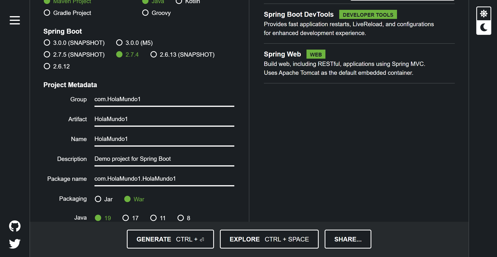
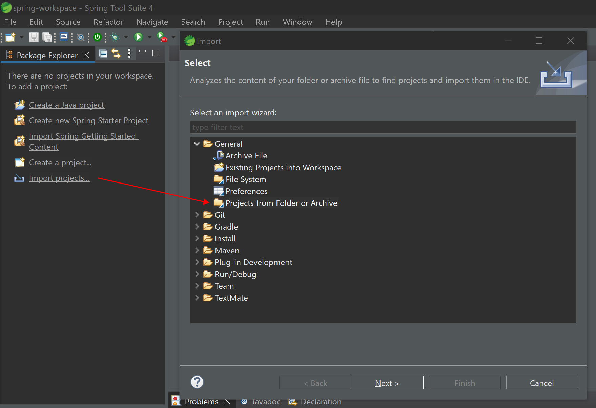
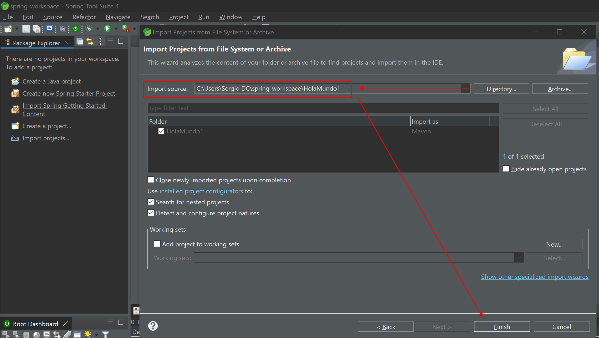
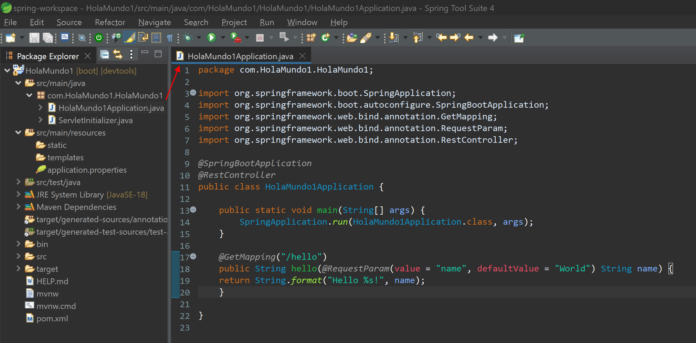
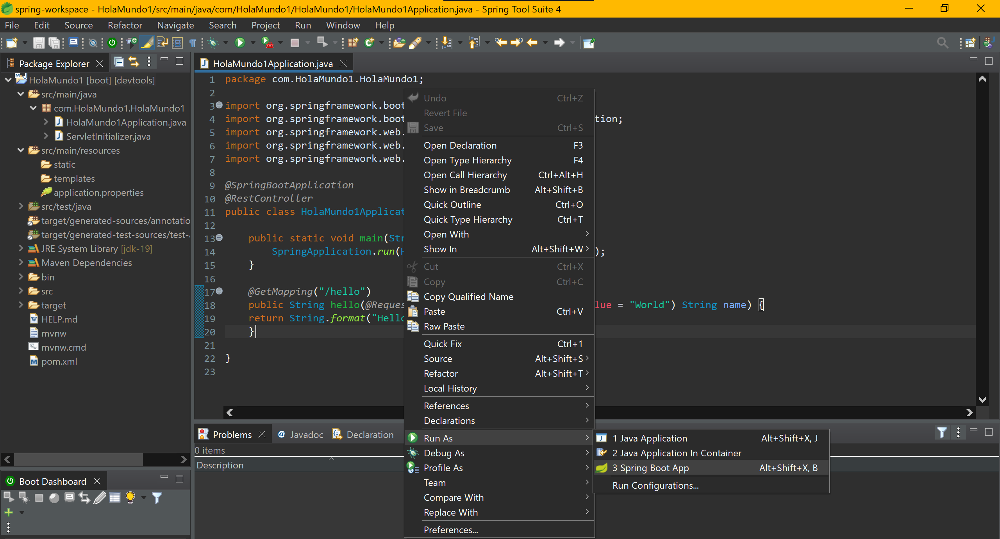
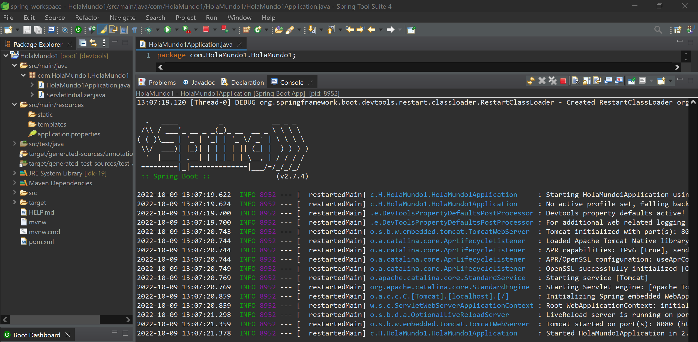
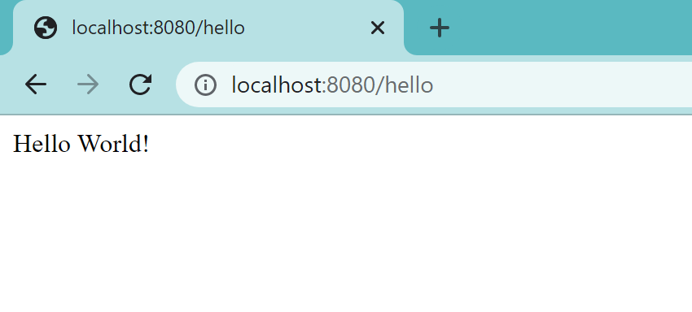
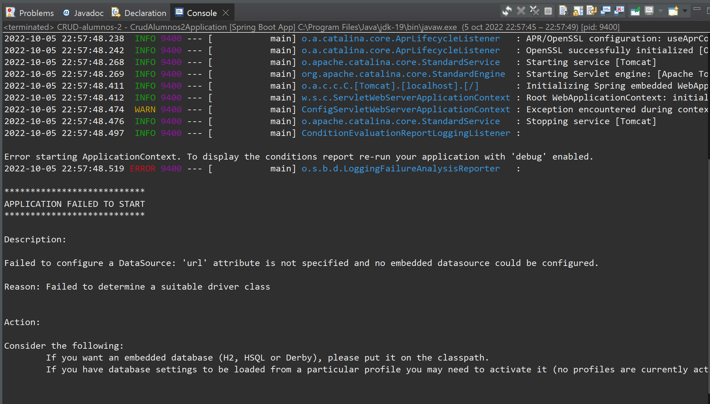

# Ejemplo de Creación y Ejecución de un proyecto de SpringBoot - Hola Mundo 1

Vamos a hacer el ejemplo del HolaMundo de la *QuickStart guide* de la web de Spring:

https://spring.io/quickstart

## ⚠️ Error de la dependencia JPA ⚠️

Normalmente, cuando creemos un nuevo proyecto de SpringBoot, añadiremos las dependencias de:

- SpringBoot Dev Tools
- Spring Web
- Spring Data JPA
- PostgreSQL Driver
- Thymeleaf
- Lombok

Pero haciendo esta práctica tan aparentemente normal, resulta que a día de hoy, el añasdir la dependencia de JPA en la creación del proyecto, hará que experimentemos un error cuando ejecutemos nuestro proyecto...

He aquí un par de enlaces a unas webs dónde se explican las causas y soluciones a este error:

- https://www.baeldung.com/spring-boot-failed-to-configure-data-source
- http://www.masterspringboot.com/data-access/jpa-applications/solving-the-error-failed-to-auto-configure-a-datasource-spring-datasource-url-is-not-specified/

No obstante, la solución a priori más recomendable por ahora, es la de crear el proyecto sin añadir la dependencia de *Spring Data JPA* en la configuración inicial para la creación del proyecto.